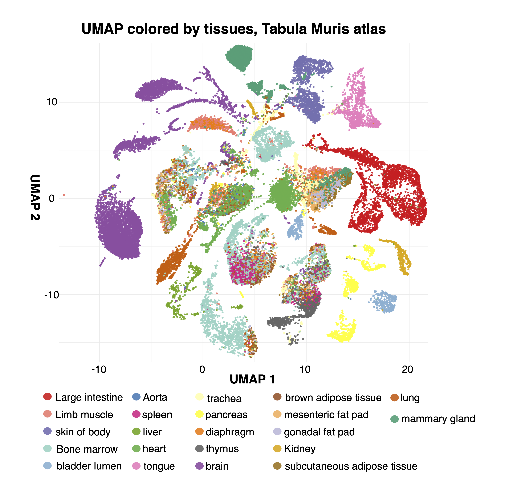
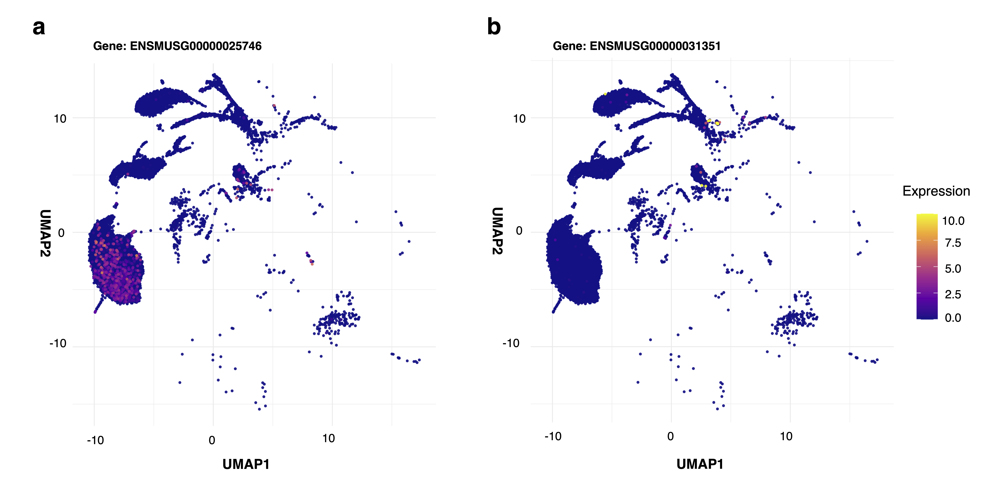
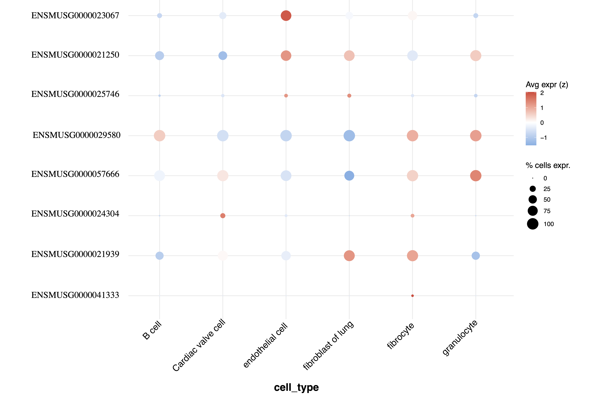
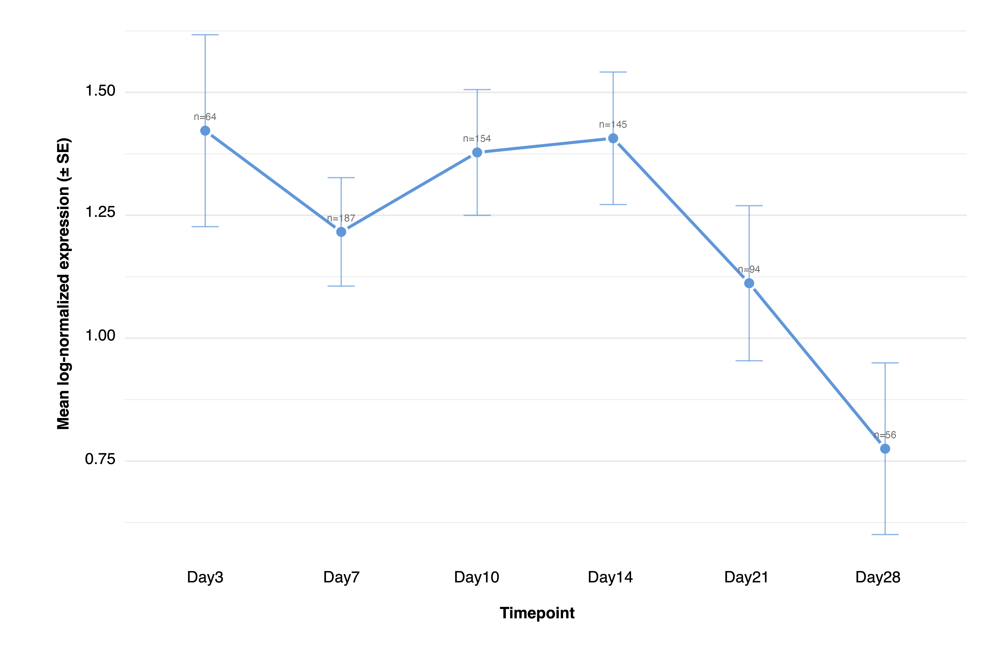
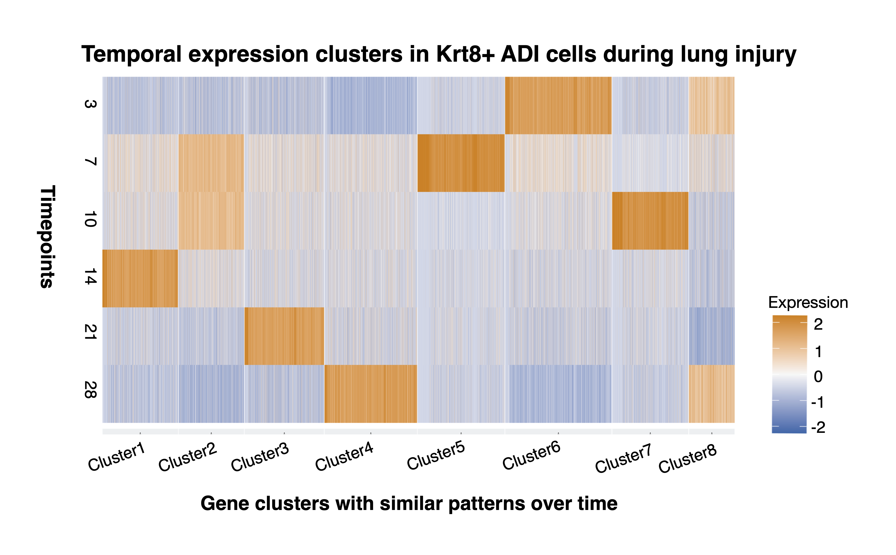
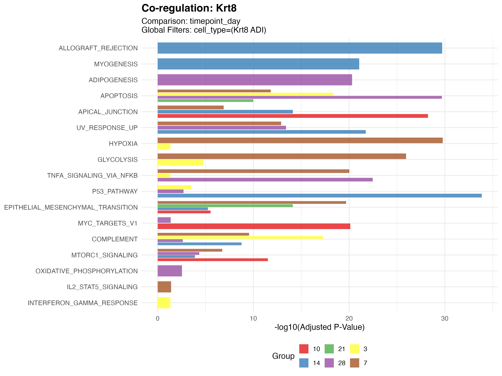
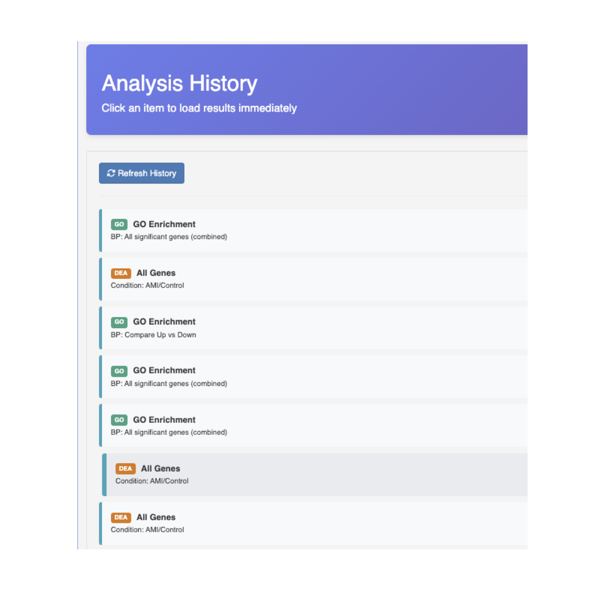

# Features

AtlasLens is an R/Shiny application for **metadata-centric exploration of
integrated scRNA-seq atlases**. Its defining capability is deep,
multi-dimensional metadata filtering: you iteratively subset cells by any
combination of metadata variables (tissue, cell type, disease status, sex,
age, time point) and immediately run downstream analyses on that exact subset.
Heavy computations run asynchronously and results are cached, so the interface
stays responsive on atlas-scale data.

The examples below use the **Tabula Muris** atlas and a time-resolved whole-lung
single-cell atlas of **bleomycin-induced lung injury and fibrosis**, as in the
paper.

<!--
  ┌──────────────────────────────────────────────────────────────────────┐
  │ HOW TO ADD YOUR FIGURES                                               │
  │ • Each <figure> block below is one image slot.                        │
  │ • Drop your photo into docs/assets/ using the exact filename shown    │
  │   in the comment above each block, then it appears automatically.     │
  │ • If a sub-feature has SEVERAL photos, copy the <figure> block and    │
  │   give each image its own filename + caption (e.g. -a, -b).           │
  │ • Adjust size with { width="650" } inside the brackets.               │
  │ • The Fig. S# / Fig. 1# notes map each slot to your paper figures.    │
  └──────────────────────────────────────────────────────────────────────┘
-->

## At a glance

| Category | What you can do |
|----------|-----------------|
| **Interactive exploration & visualization** | Metadata-driven UMAP, side-by-side metadata vs. gene expression, gene co-expression, dot plots, QC violins, per-cell metadata inspection. |
| **Differential expression & enrichment** | Metadata-based DEA with volcano plot + table; GO enrichment with rrvgo redundancy reduction (scatter + heatmap). |
| **Time-series analysis** | Temporal expression trends, k-means clustering of genes by trajectory, per-timepoint heatmaps / boxplots / violins. |
| **Gene function (GeneCOCOA)** | Context-dependent functional profiling of a gene across metadata-defined conditions. |
| **Reproducibility & history** | Session history panel and automatic R-code export for every analysis. |

---

## Interactive exploration & visualization

Explore atlases through dynamic UMAP visualization and metadata-driven
filtering. Cells can be coloured by any metadata attribute (cell type, tissue,
disease status, sex, age, condition), and the **deep multi-dimensional filter**
propagates to every downstream tab so the same cohort is analysed throughout a
session.

### Metadata-driven UMAP

Colour the UMAP by any metadata attribute to orient yourself within a large
multi-tissue atlas.

<!-- FIGURE — filename: feature-umap-metadata.png  (paper Fig. 1b) -->
<figure markdown="span">
  { width="650" }
  <figcaption>Metadata-driven UMAP exploration (Tabula Muris, coloured by tissue of origin).</figcaption>
</figure>

### Side-by-side UMAP: metadata vs. gene expression

Two UMAPs are shown next to each other — one coloured by the selected metadata,
the other by expression of a selected gene — enabling direct comparison of
expression patterns with metadata distributions.

<!-- FIGURE — filename: feature-umap-sidebyside.png  (Fig. S3) -->
<figure markdown="span">
  { width="700" }
  <figcaption>Side-by-side UMAP: metadata (left) vs. expression of a selected gene (right).</figcaption>
</figure>

### Gene co-expression

Display two genes at once on the same low-dimensional embedding to assess
spatial co-expression within a defined metadata context.

<!-- FIGURE — filename: feature-coexpression.png  (Fig. S5) -->
<figure markdown="span">
  { width="700" }
  <figcaption>Co-expression of two genes on the same UMAP embedding (brain tissue).</figcaption>
</figure>

### Dot plot of gene expression

Explore expression of a user-selected or uploaded gene list across chosen
metadata categories. Dot colour shows mean (z-scored) expression; dot size
shows the percentage of cells expressing each gene.

<!-- FIGURE — filename: feature-dotplot.png  (Fig. S4) -->
<figure markdown="span">
  { width="650" }
  <figcaption>Dot plot of expression across selected cell types (user-defined genes and groupings).</figcaption>
</figure>

### Quality-control violins

Inspect QC metrics — detected features (nFeature), total counts (nCount), and
mitochondrial percentage (percent.mt) — at **any level of metadata filtration**,
for example within specific cell types, tissues, or a filtered subset.

<!-- FIGURE — filename: feature-qc.png  (Fig. S1) -->
<figure markdown="span">
  { width="700" }
  <figcaption>QC metrics (nFeature, nCount, percent.mt) for a selected metadata subset.</figcaption>
</figure>

### Single-cell metadata inspection

Select individual cells directly from the UMAP and inspect all associated
metadata for that cell. Interactive zoom and point selection support precise
identification within dense embeddings.

<!-- FIGURE — filename: feature-cell-metadata.png  (Fig. S10) -->
<figure markdown="span">
  { width="700" }
  <figcaption>A selected cell highlighted on the UMAP with its full metadata shown in a table.</figcaption>
</figure>

---

## Differential expression & enrichment

### Differential expression (DEA)

Run metadata-based DEA for any combination of metadata and deep filtration
(e.g. a sub-dataset, a dataset-specific cell type, sex, and more). Set custom
adjusted p-value and log fold-change thresholds, highlight genes of interest on
the volcano plot, and download both the plot and the full results table.

<!-- FIGURE — filename: feature-dea-volcano.png  (Fig. S2) -->
<figure markdown="span">
  { width="650" }
  <figcaption>Volcano plot of differential expression with adjustable significance thresholds and a downloadable results table.</figcaption>
</figure>

### GO enrichment

Perform Gene Ontology over-representation analysis on DEA results or an uploaded
gene list. Results are visualised as enrichment dot plots, and can be split by
direction of regulation (up- vs. down-regulated).

<!-- FIGURE — filename: feature-go-dotplot.png  (Fig. S6) -->
<figure markdown="span">
  { width="650" }
  <figcaption>GO enrichment dot plot; dot size indicates gene ratio and colour the adjusted p-value.</figcaption>
</figure>

### Summarized GO (rrvgo redundancy reduction)

AtlasLens reduces redundancy among overlapping GO terms with the
[rrvgo](https://www.bioconductor.org/packages/rrvgo/) package, clustering
semantically similar terms into representative parent
groups. Two complementary summarized views are provided: a **scatter plot** and
a **heatmap**.

<!-- FIGURE — filename: feature-go-scatter.png  (Fig. S7 / Fig. 1e) -->
<figure markdown="span">
  { width="650" }
  <figcaption>rrvgo scatter plot: pairwise semantic similarity between enriched GO terms.</figcaption>
</figure>

<!-- FIGURE — filename: feature-go-heatmap.png  (Fig. S8) -->
<figure markdown="span">
  { width="650" }
  <figcaption>rrvgo heatmap: hierarchically clustered semantic-similarity matrix annotated by representative parent term.</figcaption>
</figure>

---

## Time-series analysis

For datasets with temporal structure, explore gene-expression dynamics across
time points. Visualise individual genes over time, cluster genes by temporal
pattern, and summarise average expression per time point.

### Temporal expression trend

Track the mean expression of a gene across defined time points for a chosen
cell type.

<!-- FIGURE — filename: feature-temporal-trend.png  (Fig. S9) -->
<figure markdown="span">
  { width="650" }
  <figcaption>Mean expression of a gene across a time course for a selected cell type (per-timepoint mean ± s.e.).</figcaption>
</figure>

### Temporal clustering & Cluster → DEA bridge

Genes are grouped by k-means clustering of their temporal trajectories into
modules (e.g. early-response, mid-phase, late-remodeling), visualised as a
heatmap. Extract the genes of any cluster and send them directly into DEA or GO
enrichment.

<!-- FIGURE — filename: feature-timeseries-clusters.png  (paper Fig. 1d) -->
<figure markdown="span">
  { width="700" }
  <figcaption>k-means clustering of gene-expression dynamics across time points; clusters can be exported for downstream analysis.</figcaption>
</figure>

---

## Gene function (GeneCOCOA)

Investigate a gene's function in a **context-dependent** manner. Select a gene
of interest, define biological conditions through metadata filtering (e.g.
tissue, cell type, disease vs. control, or across several time points), and
compare associated functional pathways across the selected groups using
[GeneCOCOA](https://doi.org/10.1371/journal.pcbi.1012278). Results are shown as
comparative bar plots, revealing condition-specific functional and
co-regulatory patterns.

<!-- FIGURE — filename: cocoa_Krt8_new.png -->
<figure markdown="span">
  { width="700" }
  <figcaption>Context-dependent functional profiling of a gene across conditions (GeneCOCOA), shown as comparative bar plots.</figcaption>
</figure>

---

## Reproducibility & history

### Session history

A dedicated **History** panel logs every analysis performed during an active
session. Click any entry to revisit the analysis, reopen its plots, and
download outputs.

<!-- FIGURE — filename: feature-history.png  (Fig. S11) -->
<figure markdown="span">
  { width="650" }
  <figcaption>The History panel: revisit, reopen, and download any analysis from the session.</figcaption>
</figure>

### Automatic R-code export

Every DEA, GO and GeneCOCOA results panel can export a self-contained R script
that reproduces the exact analysis — loading the [Seurat](https://satijalab.org/seurat/) object, re-applying the
active metadata filter, and re-running with the same comparison, thresholds and
mode — so workflows remain transparent and reproducible.
