# User guide

This guide walks you through AtlasLens tab by tab: getting oriented on the main
page, then using each analysis module. Read it in order the first time, or jump
straight to the tab you need.

## The main page

When you open AtlasLens, you land on the **Introduction** tab — the app's home
page.

<figure markdown="span">
  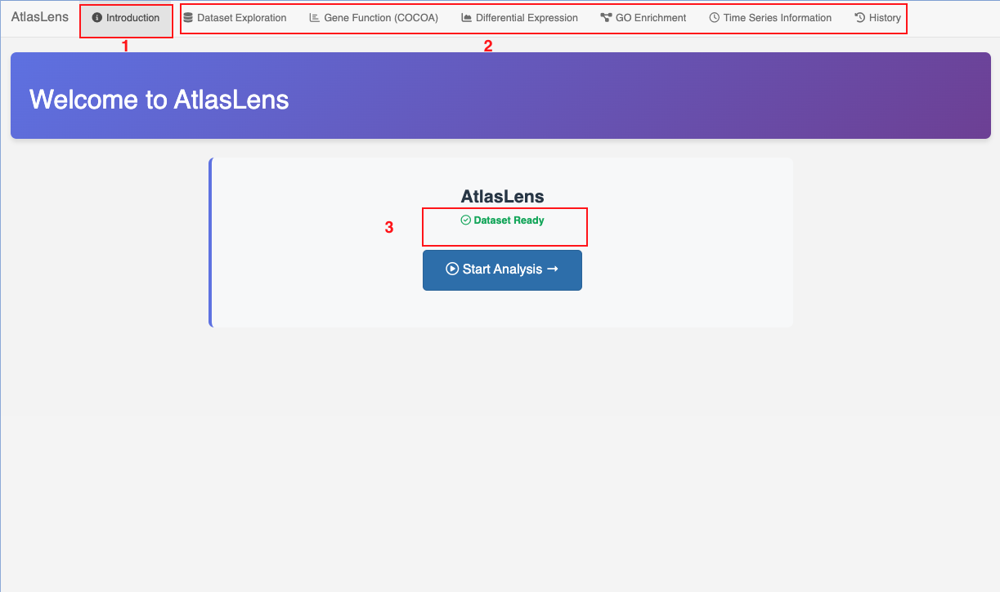{ width="850" }
  <figcaption>The AtlasLens landing page (Introduction tab).</figcaption>
</figure>

Three things to notice:

1. **Current tab** — the tab you are currently viewing is highlighted. You start
   on **Introduction**.
2. **All other tabs** — every analysis module is one click away along the top:
   Dataset Exploration, Gene Function (COCOA), Differential Expression, GO
   Enrichment, Time Series Information, and History.
3. **Dataset panel** — this card shows the dataset status. **✓ Dataset Ready**
   confirms your [Seurat](https://satijalab.org/seurat/) object has loaded. If you provided a dataset description
   in the configuration, it is displayed here. Click **▶ Start Analysis** (or
   any tab at the top) to begin.

!!! info "Gene-identifier switch"
    If your data uses Ensembl IDs, a **Displayed gene identifiers** toggle (Gene
    symbols / Ensembl IDs) appears on this page **after** you convert the IDs in
    the [Gene Function (COCOA)](#gene-function-cocoa) tab.

!!! tip
    The **Dataset Ready** message means AtlasLens has successfully loaded the
    Seurat object set by `DATASET_PATH`. If you see an error instead, check the
    [Getting started](getting-started.md#dataset-configuration) page.

## Dataset Exploration

The **Dataset Exploration** tab is the one place that contains **four sub-tabs**
— **Metadata UMAP**, **Coexpression**, **Multi-gene Dot Plot**, and **QC
Violins** — each covered in its own section below. (Every other tab in this guide
is a single page.)

The left-hand panel stays in place across all four sub-tabs: the **Filter cells**
section at the top is shared, so your filters carry over, while the controls and
buttons below it change to match the sub-tab you are viewing.

### Sub-tab 1 — Metadata UMAP

Shows cells on two UMAPs side by side: the left coloured by a metadata attribute,
the right by the expression of a chosen gene.

<figure markdown="span">
  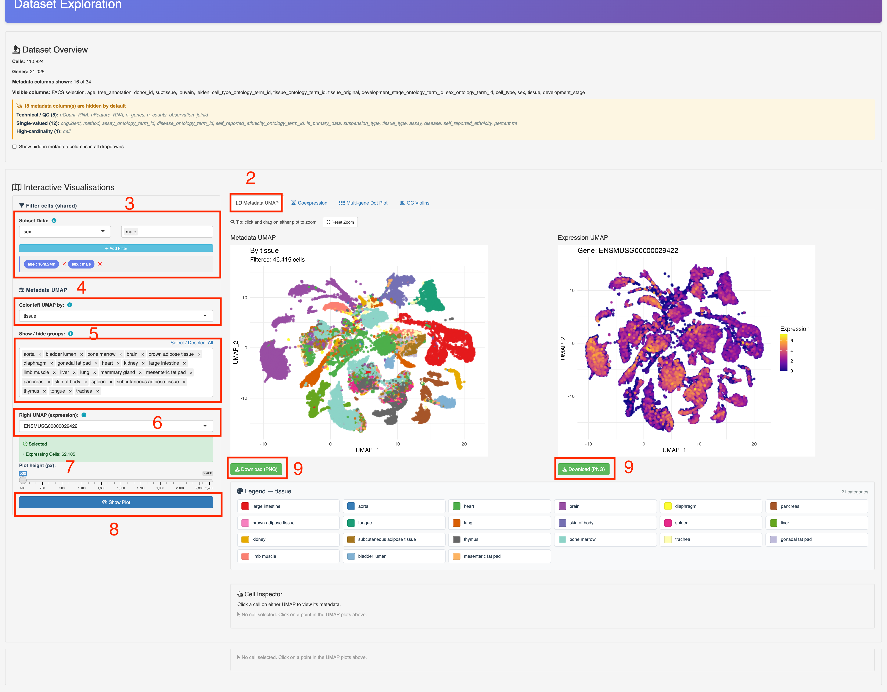{ width="900" }
  <figcaption>The Metadata UMAP sub-tab.</figcaption>
</figure>

1. **Dataset Exploration tab** — the second tab in the top bar; you are now
   inside it.
2. **Metadata UMAP** — the first of the four sub-tabs, currently selected.
3. **Filter cells (shared)** — filter your data at any level: pick a metadata
   column and a value (for example *age = 18m, 24m* and *sex = male*) and click
   **Add Filter**. Each active filter appears as a chip; keep adding filters to
   drill down further. This filter is shared with the other tabs.
4. **Color left UMAP by** — choose which metadata colours the left (metadata)
   UMAP; here it is *tissue*.
5. **Show / hide groups** — the values of the colouring metadata (the tissues).
   This list is editable, so you can show or hide individual groups.
6. **Right UMAP (expression)** — choose a gene of interest to display its
   expression on the right-hand UMAP.
7. **Plot height (px)** — set the height of the two UMAP plots.
8. **Show Plot** — render the two UMAPs based on your selections.
9. **Download (PNG)** — download either plot as a PNG.

### Sub-tab 2 — Coexpression

Displays the expression of **two genes** side by side on the same embedding, so
you can compare their patterns within a chosen subset of cells.

<figure markdown="span">
  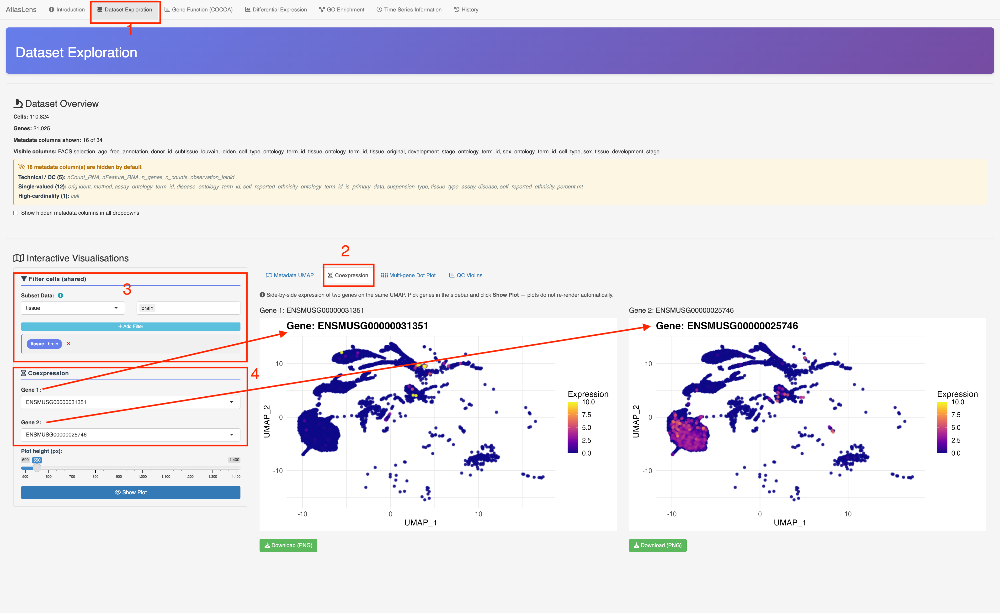{ width="900" }
  <figcaption>The Coexpression sub-tab: expression of two selected genes across the filtered cells.</figcaption>
</figure>

2. **Coexpression** — the second sub-tab, now selected.
3. **Filter cells (shared)** — as in every sub-tab, filter and choose the
   metadata you are interested in.
4. **Gene 1 / Gene 2** — search for, or paste, the names of the two genes you
   want to compare, then click **Plot**.

As the arrows show, the two UMAPs then display the expression of each selected
gene across your chosen metadata. As with every tab, click **Download (PNG)** to
save each figure.

### Sub-tab 3 — Multi-gene Dot Plot

Summarises several genes at once across your chosen groups. For each gene in each
group, the **dot colour** shows the average expression and the **dot size** shows
the percentage of cells expressing the gene.

<figure markdown="span">
  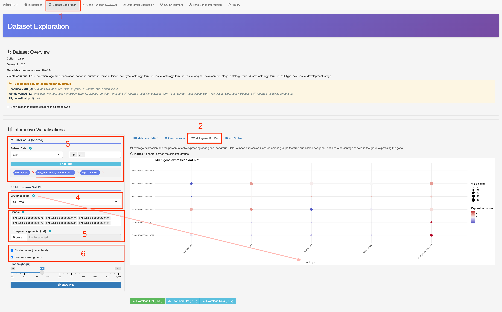{ width="900" }
  <figcaption>The Multi-gene Dot Plot sub-tab.</figcaption>
</figure>

1. **Dataset Exploration tab** — the second tab in the top bar.
2. **Multi-gene Dot Plot** — the third sub-tab, now selected.
3. **Filter cells (shared)** — as in every sub-tab, filter and choose the
   metadata you are interested in (here *sex = female*; *cell_type = B cell,
   bladder cell, brain pericyte, adventitial cell, hematopoietic stem cell*;
   *age = 18m, 21m*). **Choose the values here first:** the groups you want the
   dot plot broken down by must be selected in this filter before they can
   appear on the plot.
4. **Group cells by** — choose the metadata column that forms the **x-axis**
   (the columns/groups) of the dot plot — here *cell_type*. This should be the
   same metadata whose values you selected in the filter in step 3; the dot plot
   then shows one column per selected value.
5. **Genes** — type or select the genes to display, **or** upload a gene list as
   a `.txt` file.
6. **Display options** —
    - **Cluster genes (hierarchical)** — reorders the gene rows by hierarchical
      clustering so genes with similar expression patterns across groups sit
      together. Needs at least 3 genes; it doesn't add or remove any.
    - **Z-score across groups** — scales each gene's expression across groups
      (mean 0, SD 1) so colours show relative high/low *per gene* rather than the
      absolute level. When off, colours show raw average expression.

Set the **Plot height (px)** if needed, then click **Show Plot** to draw the dot
plot. You can save it with **Download Plot (PNG)** or **Download Plot (PDF)**, and
export the underlying values with **Download Data (CSV)**.

### Sub-tab 4 — QC Violins

Shows single-cell quality-control metrics as violin plots for the cells you have
selected, split by a grouping column. Three metrics are shown, one panel each:
**nFeature** (number of detected genes per cell), **nCount** (total UMI counts
per cell), and **percent.mt** (percentage of mitochondrial UMIs per cell).

<figure markdown="span">
  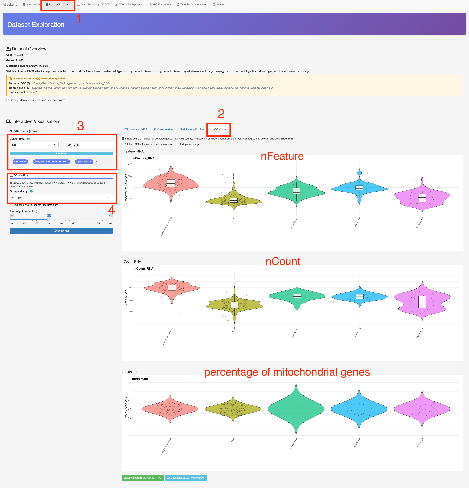{ width="900" }
  <figcaption>The QC Violins sub-tab: nFeature, nCount, and percent.mt per group.</figcaption>
</figure>

1. **Dataset Exploration tab** — the second tab in the top bar.
2. **QC Violins** — the fourth sub-tab, now selected.
3. **Filter cells (shared)** — as in the other sub-tabs, filter and choose the
   metadata you are interested in (here *sex = female*; *cell_type = B cell,
   bladder cell, brain pericyte, adventitial cell, hematopoietic stem cell*;
   *age = 18m, 21m*). **Choose the values here first:** the groups you want on
   the x-axis must be selected in this filter before they can appear.
4. **Group cells by** — choose the metadata column that forms the **x-axis**
   (one violin per group) — here *cell_type*. As with the dot plot, this should
   be the same metadata whose values you selected in the filter in step 3.

You can optionally tick **Log-scale y-axis** (for the counts/features panels) and
set **Plot height per violin (px)**, then click **Show Plot**. Save everything
with **Download all QC violins (PNG)** or **Download all QC violins (PDF)**.

<!--
  ============================================================================
  SECTIONS TO FILL (scaffold below — replace bracketed text and drop a
  screenshot into docs/assets/ using the filename in each comment).
  Sections follow the app's tab order.
  ============================================================================
-->

## Gene Function (COCOA)

The **Gene Function (COCOA)** tab profiles the context-dependent function of a
gene using [geneCOCOA](https://github.com/si-ze/geneCOCOA). Because geneCOCOA's pathway gene sets are **symbol-based**,
it needs gene symbols — so if your dataset is stored with **Ensembl IDs**, you
have to convert them once before the analysis controls unlock.

<figure markdown="span">
  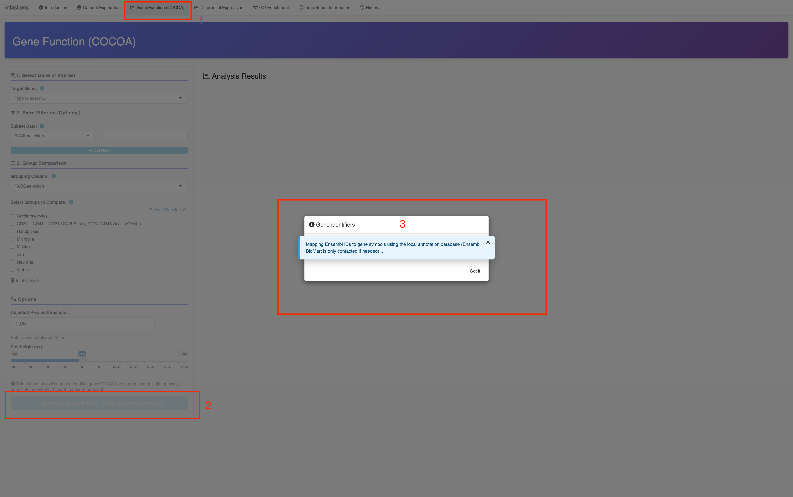{ width="900" }
  <figcaption>The Gene Function (COCOA) tab. If the dataset uses Ensembl IDs, convert them first to activate the sidebar.</figcaption>
</figure>

1. **Gene Function (COCOA) tab** — selected in the top bar.
2. **Convert gene IDs** — when your dataset uses Ensembl IDs, the left sidebar
   stays locked and a note explains that geneCOCOA needs gene symbols. Click the
   button at the bottom of the sidebar to start the conversion; while it runs it
   shows *"Converting gene IDs… (this can take a minute)."*
3. **Conversion message** — a dialog confirms it is *mapping Ensembl IDs to gene
   symbols using the local annotation database* ([Ensembl BioMart](https://www.ensembl.org/info/data/biomart/index.html)
   is only contacted if needed). Depending on your device's power this can take anywhere
   from a few seconds to a few minutes. Click **Got it** to dismiss it.

Once the conversion finishes, the left sidebar becomes active and you can set up
the analysis (check the below instruction for the analysis).

!!! note
    If your dataset already uses gene symbols, the sidebar is active from the
    start and no conversion is needed.

### Switching between symbols and Ensembl IDs

Once you have converted the IDs, a **Displayed gene identifiers** switch appears on
the **Introduction** page, letting you toggle how genes are labelled throughout the
app between **Gene symbols** and **Ensembl IDs**.

<figure markdown="span">
  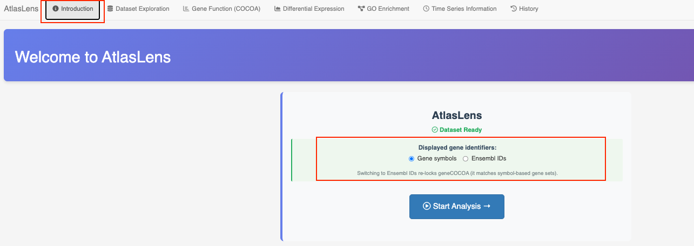{ width="900" }
  <figcaption>After conversion, the Introduction page lets you switch the displayed gene identifiers.</figcaption>
</figure>

!!! warning
    Switching back to **Ensembl IDs re-locks geneCOCOA**, because geneCOCOA's
    pathway gene sets are symbol-based. Keep **Gene symbols** selected to run
    geneCOCOA.

### Running the analysis

With the sidebar active, you set up and run the geneCOCOA analysis from the three
numbered steps on the left.

<figure markdown="span">
  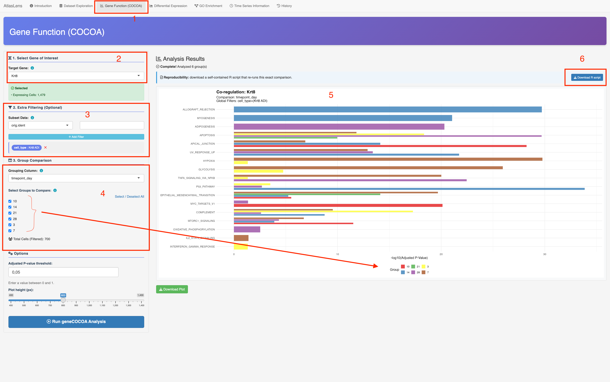{ width="900" }
  <figcaption>A completed geneCOCOA analysis: co-regulation of Krt8 across timepoints.</figcaption>
</figure>

1. **Gene Function (COCOA) tab** — selected in the top bar.
2. **Select Gene of Interest** — choose your **Target Gene** (here *Krt8*). Once
   selected, AtlasLens confirms it and reports how many cells express it
   (*Expressing Cells: 1,479*).
3. **Extra Filtering (optional)** — narrow the cells used for the analysis by
   adding metadata filters, exactly as on the other tabs (here
   *cell_type = Krt8 ADI*).
4. **Group Comparison** — pick a **Grouping Column** (here *timepoint_day*) and
   tick the **groups to compare** (here the timepoints). The footer shows how
   many cells are in the current selection (*Total Cells (Filtered): 700*). Each
   selected group becomes one coloured series in the results.

Set the **Adjusted P-value threshold** and **Plot height** under *Options*, then
click **Run geneCOCOA Analysis**.

5. **Analysis Results** — the co-regulation bar plot appears on the right
   (*Co-regulation: Krt8*). Pathways run down the y-axis and bar length is the
   **−log10(adjusted p-value)**; bars are coloured by your comparison group, so
   you can see how each pathway's association shifts across groups. Use **Download
   Plot** to save the figure.
6. **Download R script** — export a self-contained R script that reproduces this
   exact analysis (same gene, filters, groups and thresholds).

## Differential Expression

The **Differential Expression** tab runs a two-group comparison and presents the
results in three views — **Volcano Plot**, **Single Gene Expression**, and
**Results Table**. You configure the comparison with the numbered steps on the
left, then click **Run Differential Analysis**.

### Volcano Plot

The Volcano Plot view shows the genome-wide result of comparing two groups.

<figure markdown="span">
  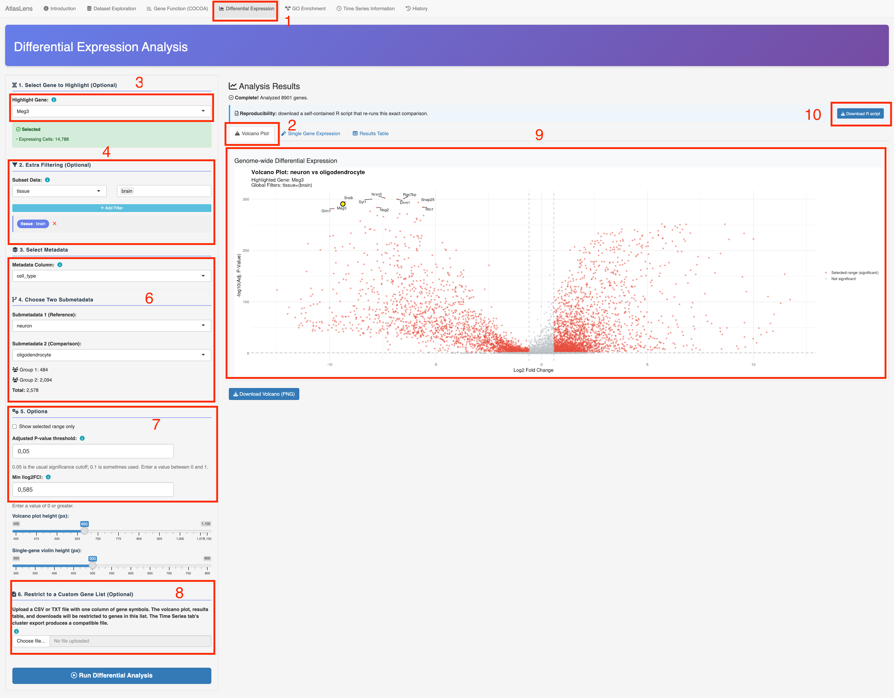{ width="900" }
  <figcaption>The Volcano Plot view: neuron vs. oligodendrocyte, with Meg3 highlighted.</figcaption>
</figure>

1. **Differential Expression tab** — selected in the top bar.
2. **View selector** — switch the results between **Volcano Plot**, **Single Gene
   Expression**, and **Results Table**. The Volcano Plot is shown here.
3. **Select Gene to Highlight (optional)** — pick a gene to label on the plot
   (here *Meg3*); AtlasLens reports how many cells express it.
4. **Extra Filtering (optional)** — narrow the cells used for the comparison with
   metadata filters (here *tissue = brain*).
5. **Select Metadata** — choose the metadata column to compare on (here
   *cell_type*).
6. **Choose Two Subsets/Metadata** — pick the **Reference** group (here *neuron*)
   and the **Comparison** group (here *oligodendrocyte*). The footer shows the
   cell counts for each group and the total.
7. **Options** — optionally tick **Show selected range only**, and set the
   **Adjusted P-value threshold** (here *0.05*) and **Min log2FC** (here *0.585*),
   plus the plot heights.
8. **Restrict to a custom gene list (optional)** — upload a CSV or TXT file with
   one column of gene symbols to limit the volcano plot, results table and
   downloads to those genes. (The Time Series tab's cluster export produces a
   compatible file.)

After clicking **Run Differential Analysis**:

9. **Volcano Plot** — each gene is plotted by **log2 fold change** (x-axis) and
   **−log10 p-value** (y-axis); the highlighted gene is labelled. Save it with
   **Download Volcano (PNG)**.
10. **Download R script** — export a self-contained R script that reproduces this
    exact comparison.

### Single Gene Expression

Shows the actual expression distribution of your highlighted gene across the two
groups being compared. We did **not** change anything in the left sidebar here —
the settings are exactly as in the previous (Volcano Plot) screenshot.

<figure markdown="span">
  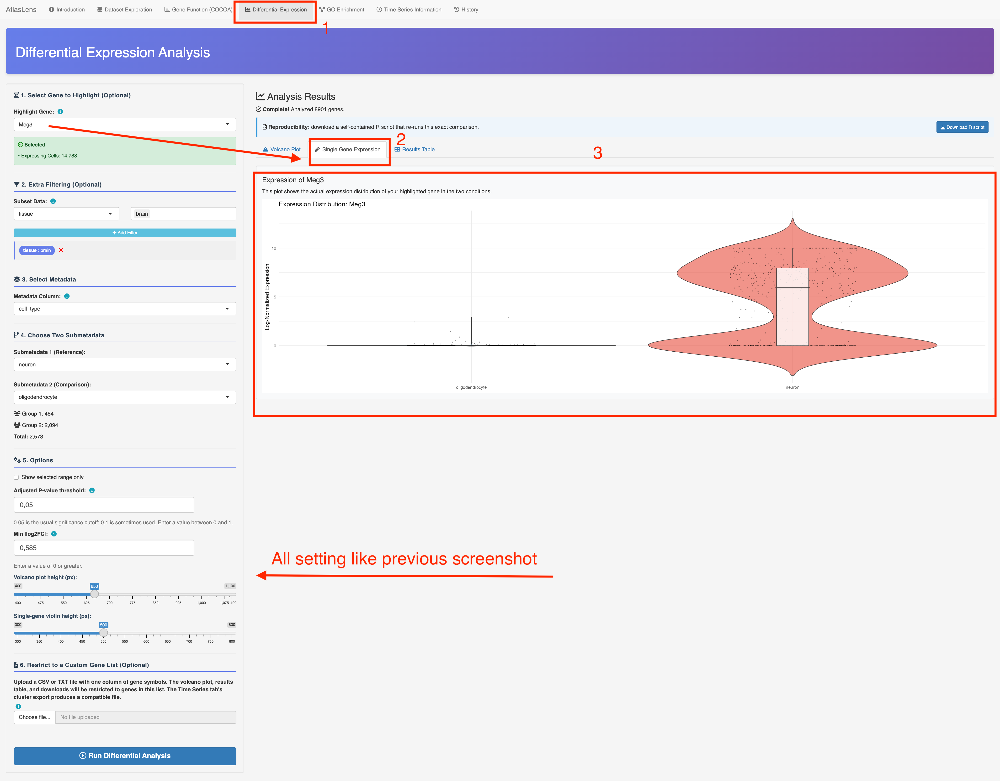{ width="900" }
  <figcaption>The Single Gene Expression view: expression distribution of Meg3 in the two conditions.</figcaption>
</figure>

1. **Differential Expression tab** — selected in the top bar.
2. **Single Gene Expression** — chosen in the view selector.
3. **Expression distribution** — violin plots show the log-normalised expression
   of the highlighted gene (here *Meg3*) in the two selected conditions —
   **neuron** cells on the right and **oligodendrocyte** cells on the left — so
   you can see directly how its expression differs between them.

### Results Table

Lists the full differential-expression result for every gene, with search,
sorting and CSV export. As with the other views, the left sidebar settings are
unchanged.

<figure markdown="span">
  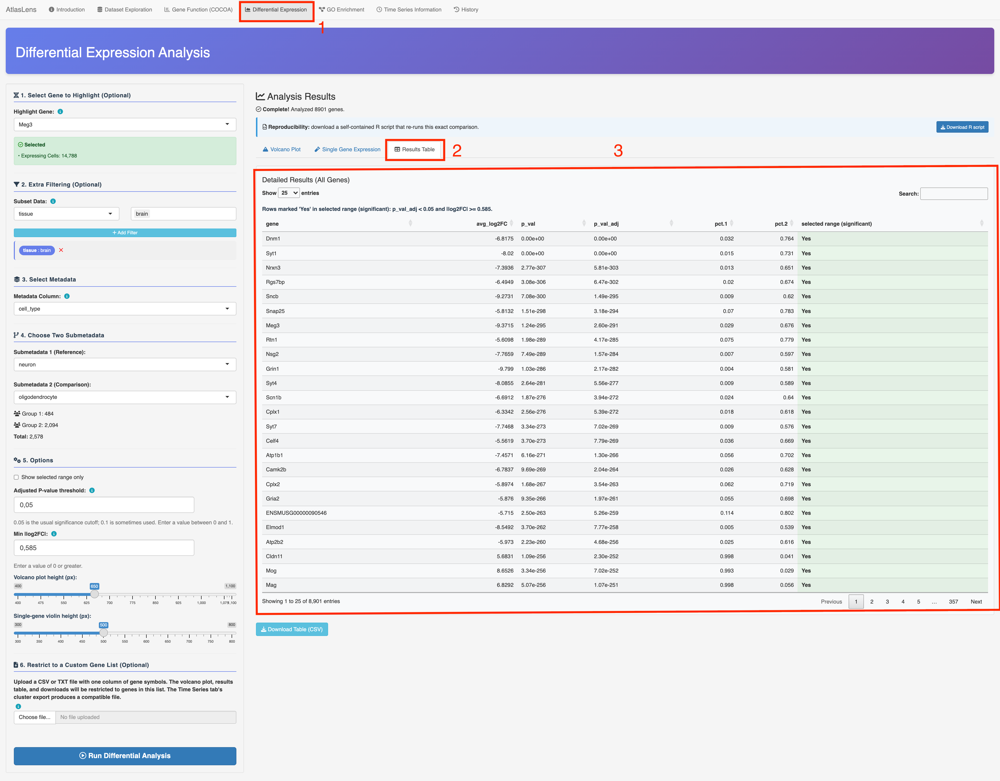{ width="900" }
  <figcaption>The Results Table view: per-gene statistics for the full comparison.</figcaption>
</figure>

1. **Differential Expression tab** — selected in the top bar.
2. **Results Table** — chosen in the view selector.
3. **Detailed results** — one row per gene, with **avg_log2FC**, **p_val**,
   **p_val_adj**, and **pct.1 / pct.2** (the fraction of cells expressing the gene
   in each group). The **selected range (significant)** column flags genes that
   pass the thresholds (here *p_val_adj < 0.05* and *|log2FC| ≥ 0.585*). Use the
   **search** box and column sorting to find genes, and **Download Table (CSV)**
   to export the full table.

## GO Enrichment

The **GO Enrichment** tab runs Gene Ontology over-representation analysis on your
genes and presents the results in four views — **Dot Plot**, **Treemap**,
**Scatter**, and **Results Table**. You configure the analysis with the numbered
steps on the left, then click **Run GO Enrichment**.

### Dot Plot

The Dot Plot view shows the top enriched GO terms.

<figure markdown="span">
  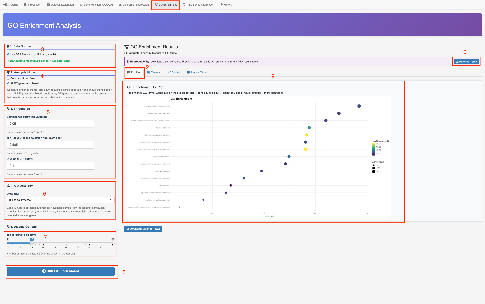{ width="900" }
  <figcaption>The GO Enrichment Dot Plot view.</figcaption>
</figure>

1. **GO Enrichment tab** — selected in the top bar.
2. **View selector** — switch the results between **Dot Plot**, **Treemap**,
   **Scatter**, and **Results Table**. The Dot Plot is shown here.
3. **Data Source** — run on the in-app **DEA results** (here *8901 genes, 4483
   significant*) or **upload a gene list**.
4. **Analysis Mode** — **All DE genes (combined)** pools every DE gene into a
   single enrichment (used here) — the only mode that detects pathways perturbed
   in both directions at once. **Compare Up vs Down** instead enriches the up- and
   down-regulated genes separately and shows them side by side (see the next
   screenshot).
5. **Thresholds** — set the **significance cutoff (adjusted p)** (here *0.05*),
   the **Min log2FC** used for gene selection / the up–down split (here *0.585*),
   and the **Q-value (FDR) cutoff** (here *0.1*).
6. **GO Ontology** — choose the ontology (here *Biological Process*). The gene-ID
   type is detected automatically; the species comes from the `species` field in
   `landing_config.json` when set, otherwise it is auto-detected from your genes.
7. **Display Options** — set **Top N terms to display** in the dot plot.

After clicking **Run GO Enrichment**:

9. **GO Enrichment Dot Plot** — the top enriched terms are plotted by **GeneRatio**
   (x-axis); **dot size** is the gene count and **colour** is the −log10 adjusted
   p-value. Save it with **Download Dot Plot (PNG)**.
10. **Download R script** — export a self-contained R script that reproduces this
    enrichment from the DEA results.

**Compare Up vs Down mode.** If you choose **Compare Up vs Down** in step 4
(Analysis Mode), the dot plot is split into two panels — **downregulated** genes
on the left and **upregulated** genes on the right — so you can compare which
pathways are enriched in each direction.

<figure markdown="span">
  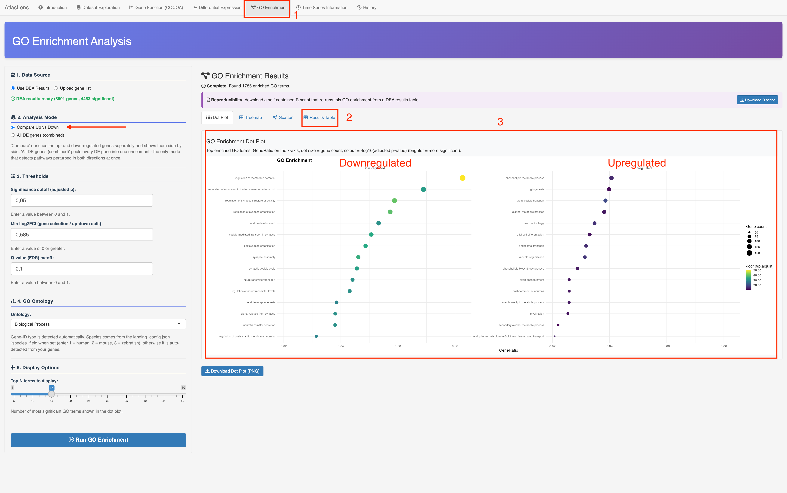{ width="900" }
  <figcaption>Dot Plot in Compare Up vs Down mode: downregulated (left) and upregulated (right).</figcaption>
</figure>

!!! note
    The remaining views below (**Treemap**, **Scatter** and **Results Table**) are
    shown for the **All DE genes (combined)** mode.

### Treemap

A summarised view of the enriched terms, produced with the
[rrvgo](https://www.bioconductor.org/packages/rrvgo/) R package: redundant GO
terms are collapsed into representative parent categories. Each tile is a parent
term, and its area scales with the term's significance.

<figure markdown="span">
  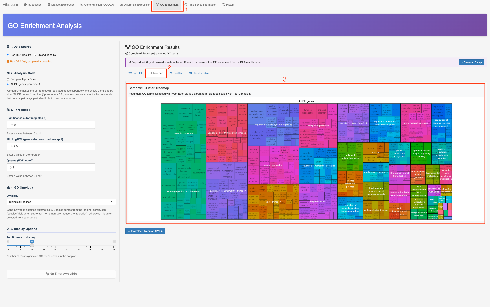{ width="900" }
  <figcaption>Semantic-cluster treemap (rrvgo): redundant GO terms grouped into parent categories. Use Download Treemap (PNG) to save it.</figcaption>
</figure>

### Scatter

Another rrvgo summarised view: enriched GO terms are placed by **semantic
similarity** and coloured by their parent term, so the layout reflects how
distinct or related the terms are.

<figure markdown="span">
  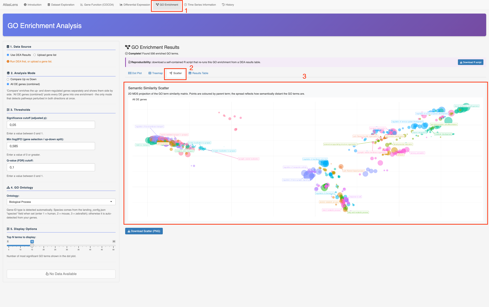{ width="900" }
  <figcaption>Semantic-similarity scatter (rrvgo): points coloured by parent term. Use Download Scatter (PNG) to save it.</figcaption>
</figure>

### Results Table

The full GO enrichment result for every term, with search, sorting and CSV export.

<figure markdown="span">
  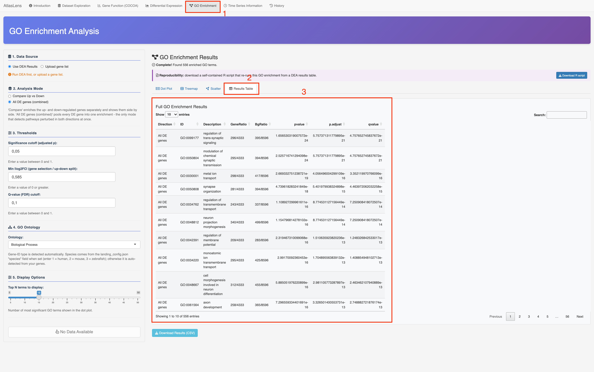{ width="900" }
  <figcaption>Full GO enrichment results (ID, description, GeneRatio, BgRatio, p-value, p.adjust, q-value), searchable and downloadable as CSV.</figcaption>
</figure>

## Time Series Information

The **Time Series Information** tab analyses how gene expression changes across
timepoints. You set up the analysis with the controls on the left, then choose one
of **four views** on the right — **Heatmap**, **Temporal Trend**, **Boxplot**, and
**Violin Plot** — each covered below. The left-hand controls stay in place; the
right-hand panel changes with the view you pick.

### Heatmap view (all genes)

Clusters all genes by their temporal pattern and shows them as a heatmap, with an
option to export any cluster for downstream analysis.

<figure markdown="span">
  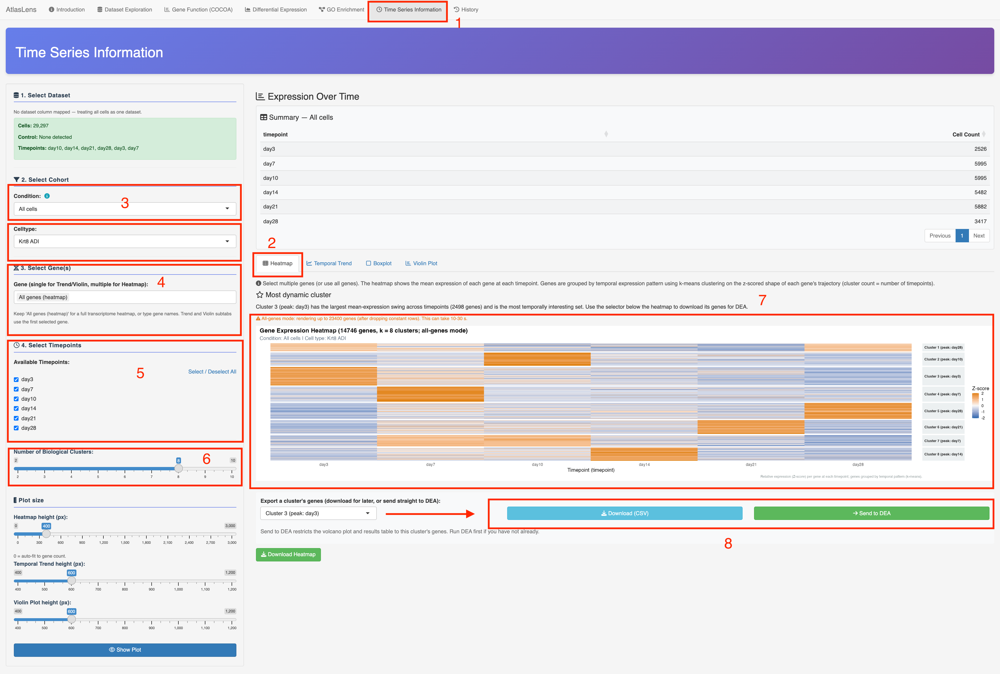{ width="900" }
  <figcaption>The Heatmap view: genes clustered by temporal pattern across timepoints.</figcaption>
</figure>

1. **Time Series Information tab** — selected in the top bar.
2. **View selector** — switch the right-hand panel between **Heatmap**, **Temporal
   Trend**, **Boxplot**, and **Violin Plot**. The Heatmap view is shown here.
3. **Select Cohort** — choose the **Condition** and **Celltype** to analyse (here
   *All cells* / *Krt8 ADI*). Above this, the **Select Dataset** section reports
   the detected cells, control status, and available timepoints.
4. **Select Gene(s)** — keep **All genes (heatmap)** for a full-transcriptome
   heatmap, or type gene names. (The Temporal Trend and Violin views use the first
   selected gene.)
5. **Select Timepoints** — tick the timepoints to include, or use **Select /
   Deselect All**.
6. **Number of Biological Clusters** — set how many clusters k-means groups the
   genes into by their temporal pattern.

Adjust the heights under **Plot size** if needed, then click **Show Plot**.

7. **Gene Expression Heatmap** — genes are clustered by temporal pattern (here 6
   clusters), and each cluster is labelled with the timepoint at which it peaks.
   AtlasLens also flags the **most dynamic cluster** — the one with the largest
   expression swing across timepoints.
8. **Export a cluster's genes** — pick a cluster, then **Download (CSV)** its gene
   list, or **Send to DEA** to carry that gene set straight into the Differential
   Expression tab (restricting its volcano plot and table to those genes).

### Temporal Trend view

Shows the mean expression trajectory of a **single gene** across the ordered
timepoints, with error bars. The left-hand controls are the same as in the Heatmap
view — the only difference is that here you select one gene of interest.

<figure markdown="span">
  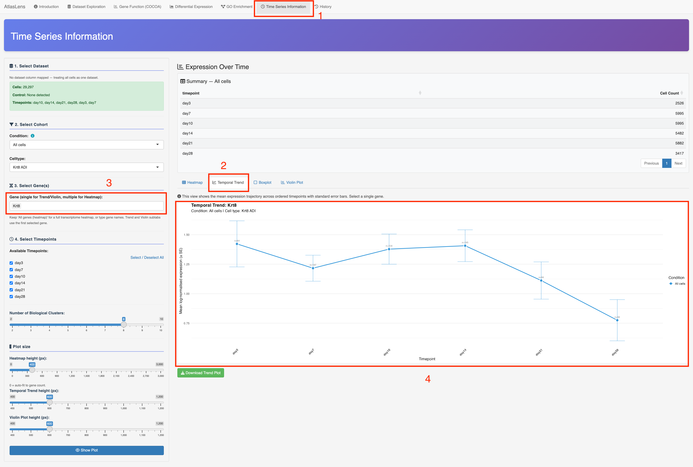{ width="900" }
  <figcaption>The Temporal Trend view: mean expression of a single gene (Krt8) across timepoints.</figcaption>
</figure>

1. **Time Series Information tab** — selected in the top bar.
2. **Temporal Trend** — chosen in the view selector.
3. **Select Gene(s)** — choose a **single gene** of interest (here *Krt8*). The
   cohort and timepoint controls work exactly as in the Heatmap view.
4. **Temporal Trend plot** — the mean log-normalised expression (with error bars)
   is plotted across timepoints for the selected cohort. Use **Download Trend
   Plot** to save it.

The remaining two views — **Boxplot** and **Violin Plot** — work in exactly the
same way; they simply show the selected gene's expression per timepoint as a
boxplot or a violin plot instead of a trend line.

## History

The **History** tab keeps a log of every analysis you run during a session, so you
can revisit any result with a single click.

<figure markdown="span">
  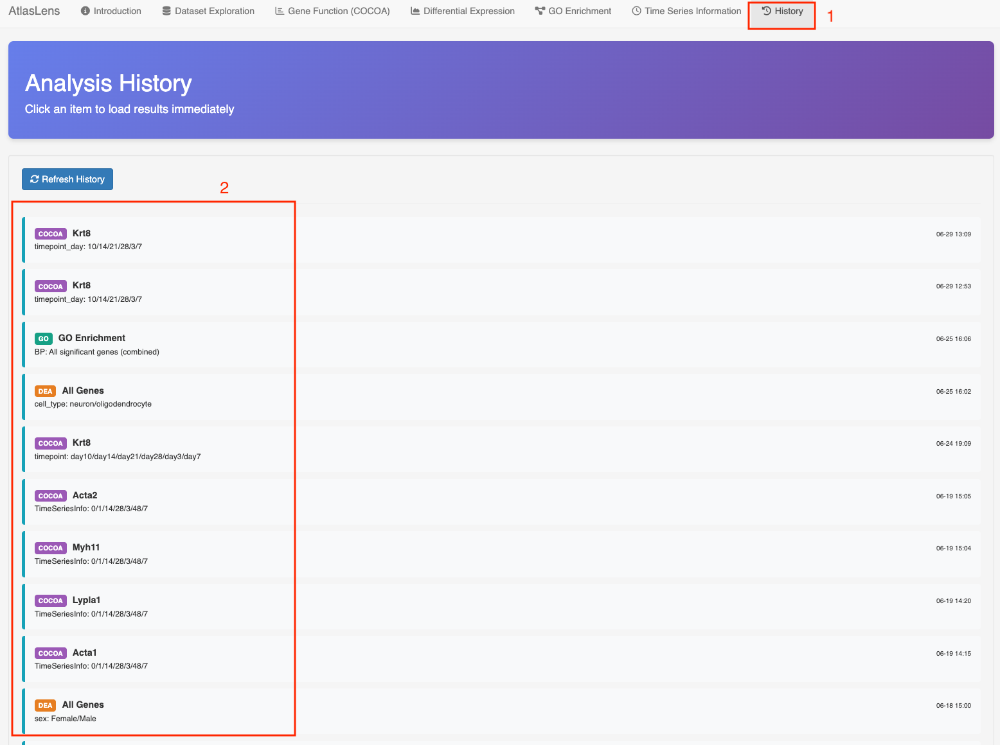{ width="900" }
  <figcaption>The Analysis History panel: every analysis from the session, ready to reload.</figcaption>
</figure>

1. **History tab** — selected in the top bar.
2. **Analysis history** — each entry is colour-coded by type (**COCOA**, **GO
   Enrichment**, **DEA**) and shows the target and key settings of that run (for
   example *Krt8 — timepoint_day: 10/14/21/28/3/7*) with a timestamp on the right.
   **Click any item to load its results immediately**; **Refresh History** updates
   the list. Restoring a saved run also re-enables its **Download R script**
   export, so previous analyses stay reproducible.
